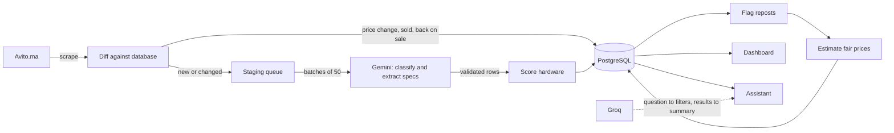

# Avito Laptop Tracker

[](https://github.com/meddhajji/avito-laptops/actions/workflows/ci.yml)

**Live: [avitolaptops.vercel.app](https://avitolaptops.vercel.app)**

Avito.ma is Morocco's largest classifieds site. Its laptop category holds about 24,000 listings written as free text in French, Arabic and Darija, with no structured specs, thousands of reposts, and prices that range from honest to absurd. Finding a good laptop there means reading hundreds of ads.

This project turns that category into a clean, queryable market:

- a **pipeline** that scrapes every listing each night, extracts the hardware specs with an LLM, removes the noise, and estimates what each laptop should cost;
- a **dashboard** that shows every listing with its specs and how its price compares with the market;
- an **assistant** that answers questions like "best deal on a gaming laptop under 10,000 DH in Casablanca" in English, French or Darija.

The same approach applies to any marketplace or catalogue where the valuable data is locked in unstructured text: price monitoring, competitor tracking, catalogue enrichment, lead qualification.

## Results

Measured on the first complete run (October 2026):

| | |
| --- | --- |
| Listings scraped | 22,936 from 700 pages, 0 failed pages, in 4.4 minutes |
| Laptops extracted | 20,730 (the other 10% were accessories, monitors, repair services) |
| Reposts detected | 7,501, leaving 13,229 distinct laptops. One seller had posted the same laptop 463 times |
| Extraction time | 63 minutes for the whole category on a free-tier model |
| Extraction accuracy | 195 of 196 field checks correct on a hand-checked set of 30 listings (see [Evaluation](#evaluation)) |
| Price model error | 15.5% median, against 51% for guessing the market median |
| Implausible prices caught | 262 listings priced more than 50% below their estimate |

## How it works



The pipeline runs nightly on GitHub Actions, started by a Vercel Cron job because GitHub's own scheduler does not fire for this repository. The web app is a Next.js project on Vercel. Both read and write one PostgreSQL database through a single `DATABASE_URL`.

### Pipeline

| Stage | What it does | The part that was hard |
| --- | --- | --- |
| **Scrape** | Reads the category page by page until Avito returns an empty one. | Knowing when a scrape is trustworthy. Pages are retried with backoff, and a scrape only counts as complete if the ads seen add up to 90% of the total Avito reports. A block page that renders as an empty list would otherwise look like the end of the category. |
| **Diff** | Compares the scrape with the database: new, changed, repriced, gone, back. | Deciding a listing is sold. Listings shift between pages while a scrape runs, so a single miss proves nothing. A listing is marked sold only after a complete scrape, and only once it has been unseen for 36 hours. |
| **Extract** | Sends listing text to Gemini, which classifies it and fills a typed schema. | Making an LLM dependable. Responses are schema-constrained and validated before anything is stored. Results are matched by ID, never by position. A listing that keeps failing is skipped instead of blocking the queue. Rejected listings are remembered so they are not paid for again every night. |
| **Score** | Rates the hardware 0 to 1000 from CPU benchmarks, GPU tier, RAM, storage and screen. | Sellers write "i5 8ème" far more often than a model number. The scorer resolves a family and generation to the average of that generation's laptop chips. |
| **Deduplicate** | Groups identical active listings and keeps the newest visible. | Reposts are flagged, not deleted. A deleted row that is still live would be scraped and extracted again the next day. |
| **Price** | Estimates each laptop's fair market price with a gradient-boosted model. | Honesty. Each listing is priced by a model that never saw it (out-of-fold prediction), and the model predicts the median so absurd listings do not drag estimates down. |

Details for each stage are in [`pipeline/README.md`](pipeline/README.md).

### Fair price

Every priced listing gets an estimate of what similar hardware is listed for, and the site shows the difference beside the price: `-22%` in green, `fair`, or `+30%`. This replaces a hand-tuned "value" score that rewarded anything cheap, including listings that were cheap because they were not real.

Listings more than 50% below their estimate (a gaming laptop "for 850 DH") are labelled for checking and kept out of the deal rankings. In practice these are deposits, typos, or parts.

### Assistant

The chat endpoint is public, so it is built to be safe to leave on the internet:

1. **Validate and limit.** Requests are size-capped and rate-limited per visitor and globally. Counters live in PostgreSQL because serverless instances share no memory. Visitors are counted by a salted hash, so no IP address is stored.
2. **Interpret.** A model turns the message into a typed filter form. It never writes SQL. Its output is sanitized and clamped before a parameterized query runs.
3. **Answer.** The rows go straight to the table. A second model call writes a short summary from the filters, the statistics and a few short listing fields. It never sees the user's text, so there is nothing to type that makes it say something else.
4. **Degrade.** Three models are tried in order. If all fail, the user still gets the table and a plain factual sentence.

The browser sends only the new question, the last few questions and the previous filters. A forged conversation history is ignored.

## Evaluation

`pipeline/evaluate.py` scores the extraction against [`eval/golden.json`](pipeline/eval/golden.json): 30 real listings from three depths of the category, with the expected fields checked by reading each one.

| Field | Before prompt fixes | After |
| --- | --- | --- |
| Keep or reject | 30/30 | 30/30 |
| Brand, RAM, storage, GPU type | 28/28 each | 28/28 each |
| CPU | 25/28 | 28/28 |
| Screen size | 27/28 | 28/28 |
| SSD flag | 28/28 | 27/28 |

The evaluation found two real defects (CPU model numbers shortened to the family, and "écran 14 3 usb" read as 14.3 inches), which were fixed in the prompt. The set is small and was also used to tune the prompt, so read these figures as indicative, not as a held-out benchmark.

## Try it with Docker

```bash
docker compose up --build
```

Open http://localhost:3000. This starts PostgreSQL, applies the migrations, loads a sample of 3,000 real listings (with reposts flagged and fair prices estimated) and serves the web app. No API key is needed to browse.

Two optional keys, set in a `.env` file next to `compose.yaml` or in your shell:

| Variable | Enables |
| --- | --- |
| `GROQ_API_KEY` | the chat assistant |
| `GEMINI_API_KEY` | running the pipeline against Avito: `docker compose run --rm pipeline python pipeline.py -p 5` |

## Running without Docker

You need a PostgreSQL database and its connection string.

```bash
# Pipeline
cd pipeline
python -m venv .venv && source .venv/bin/activate   # Windows: .venv\Scripts\activate
pip install -r requirements.txt
cp .env.example .env                                 # set DATABASE_URL and GEMINI_API_KEY
python db.py migrate
python db.py seed                                    # optional: load the sample listings
python pipeline.py -p 5                              # trial run on 5 pages; omit -p for the whole category

# Web app
cd frontend
npm install
cp .env.example .env.local                           # set DATABASE_URL and GROQ_API_KEY
npm run dev
```

## Tests and CI

```bash
cd pipeline && pip install -r requirements-dev.txt && TEST_DATABASE_URL=postgresql://... pytest
cd frontend && npm test
```

- **Pipeline:** 58 tests. Database tests run against a real PostgreSQL, each in its own throwaway schema. Avito and the LLM are replaced by fakes, so no network or API key is needed.
- **Web app:** 27 unit tests covering filter sanitizing, query building, request validation and rate limits.
- **CI** ([`ci.yml`](.github/workflows/ci.yml)) runs both on every push, plus lint, type-check, a production build, and a smoke test that starts the whole Docker Compose stack and checks the dashboard serves listings.

## Repository layout

```text
db/
  migrations/          SQL schema, applied in order by `python db.py migrate`
  seed/                3,000 sample listings for local runs
pipeline/
  pipeline.py          Orchestrator: refresh, parse, dedup, pricing; every run is logged
  scraper.py           Fetches listing pages and extracts ads
  refresh.py           Diffs the scrape against the database
  parser.py            LLM classification and spec extraction
  score_laptops.py     Hardware scoring
  dedup.py             Repost detection
  pricing.py           Fair price model
  evaluate.py          Extraction accuracy against eval/golden.json
  tests/               pytest suite
frontend/
  app/avito/           Dashboard
  app/avitopt/         Assistant
  app/api/chat/        Chat endpoint
  lib/chat/            Filters, query builder, rate limiter, model calls
compose.yaml           One-command local stack
.github/workflows/     CI and the nightly pipeline run
```

## Data model

| Table | Purpose |
| --- | --- |
| `laptops` | One row per listing: specs, score, `fair_price`, `deal_pct`, previous price, sold status, timestamps |
| `new_laptops` | Staging queue of listings waiting for extraction |
| `rejected_listings` | Listings already rejected as non-laptops, so they are not extracted again |
| `price_history` | Every price a listing has had, written by a trigger |
| `pipeline_runs` | One row per run: status, counters, and the price model's error |
| `chat_usage` | Rate-limit counters for the assistant |

Row-level security is enabled on every table with no policies: the app and pipeline connect directly, and nothing is reachable through an auto-generated public API.

## Stack

| | |
| --- | --- |
| Pipeline | Python, `requests`, `beautifulsoup4`, `google-genai`, `pydantic`, `scikit-learn`, `psycopg` |
| Database | PostgreSQL (hosted on Supabase; any PostgreSQL 14+ works) |
| Web app | Next.js (App Router), React, Tailwind CSS, Vercel AI SDK, Groq |
| Automation | GitHub Actions, Docker Compose |

## Limits

- The fair price is an estimate from asking prices, not sale prices, and it knows nothing about a laptop's physical condition. A typical estimate is within 15% of the asking price; treat smaller differences as noise.
- Listing dates come from Avito's relative labels ("il y a 3 jours"), so they are approximate for older listings.
- The assistant runs on free-tier model quotas and is capped at 400 conversations a day.

## Scraping notes

The scraper reads public listing pages at a limited rate and stores only listing content: title, description, price, city and link. Seller names and phone numbers are not stored, and every row links back to the original listing on Avito.

## Contact

Mohamed Hajji, engineering student at EMINES, UM6P. [LinkedIn](https://www.linkedin.com/in/mohamed-hajji-301330282) · Mohamed.hajji@emines.um6p.ma
